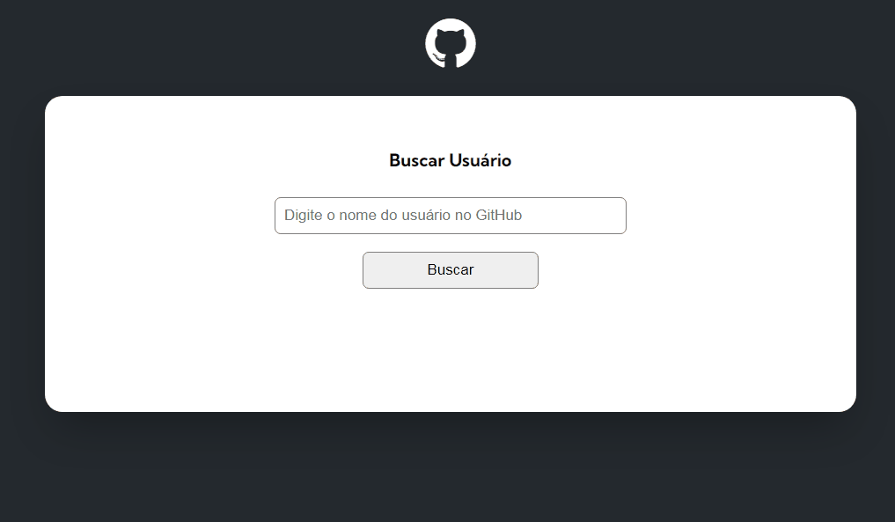

# Projeto API  do github 
<i class="devicon-github-original"></i>

Projeto para exemplicar uma página com a api do github 
<i class="devicon-github-original"></i>

<br>



<br>
Projeto sendo executado em dispositívos móveis

<br>


<br>

# Tecnologias Utilizadas &#128218;

- HTML
- CSS
- JavaScript
- API GitHub

<br>

# Como Utilizar

Clone o projeto

```
git clone <url>